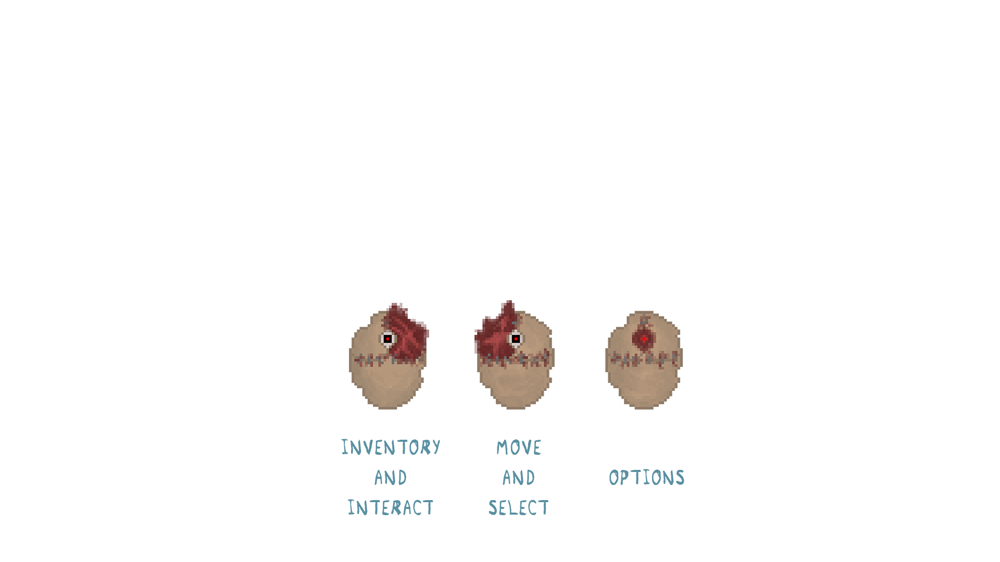
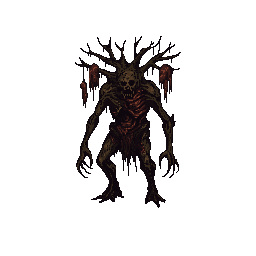

BODIES is a survival horror RPG where you play as Sam Skyler, a forensic doctor who, after a car accident, gets thrown into a pile of bodies by a mad doctor who stole her skin. With a disfigured body and scarce allies, you will have to traverse the doctors’ property searching for clues on why this is happening and how you can recover your flesh.

Will you find your flesh? Or will you lose your mind?

# Members and Roles

Ton Casals (Tontito05): Game and Level Designer, Technical Artist & Developer (if necessary)  
Mario Martos (MarioPrincesita): Game and Level Designer, UI Designer, Audio Producer & Artist  
Didac Sillue (digui048): Developer  
Alba Fernández (aria00015): Art Team Leader & Artist  
Fco. Javier Pedreño (Wakiren): Technical Leader & Developer  

# Features implemented so far

- Main Character
- Functional Dialogue System
- 2 NPCs 
- 2 Enemies with diferent behaviours
- Simplified Combat System
- Main map with 3 main parts to visit
- Main theme
- Main Menu and Options (8 on the keyboard)
- The main narrative
- Boss Tree
- Puzzle (recollection of the symbols) --> Invoke the Boss Tree
- New Zone of tunnels
- SFX Done
- Tutorial and intuitive path to keep the track
- New Main Menu with animations, sounds, and buttons with textures
- Ambience Sounds Done
- New Filter for the main character
- Enemies can't be seen unless the light of filter is in the right position
- Functional Combat system without invulnerability and well balanced
- Interactive inventory Done
- New controllers for using the Character:

   

# Debug Keys

- F1 to see the colisions
- F4 to skip the intro
- F5 to save game
- F6 to load game
- P to pause entities
- U to active entities
- Space for creating each item (unless symbols)
  

# Links to Documentation
<a href="https://drive.google.com/drive/folders/1i3_Qv9t4M01fuHDAjrKHgk-LapJa3BmO">Main Documentation</a>

# Links to Latest Release
<a href="https://github.com/Wakiren/Bodies/releases/tag/Alpha">Main Documentation</a>

# Links to The postmortems
<a href="https://drive.google.com/drive/folders/1Pq1wpdmgUc9QCzvDuu38sorp-46hsnoc?usp=drive_link">Main Documentation</a>

